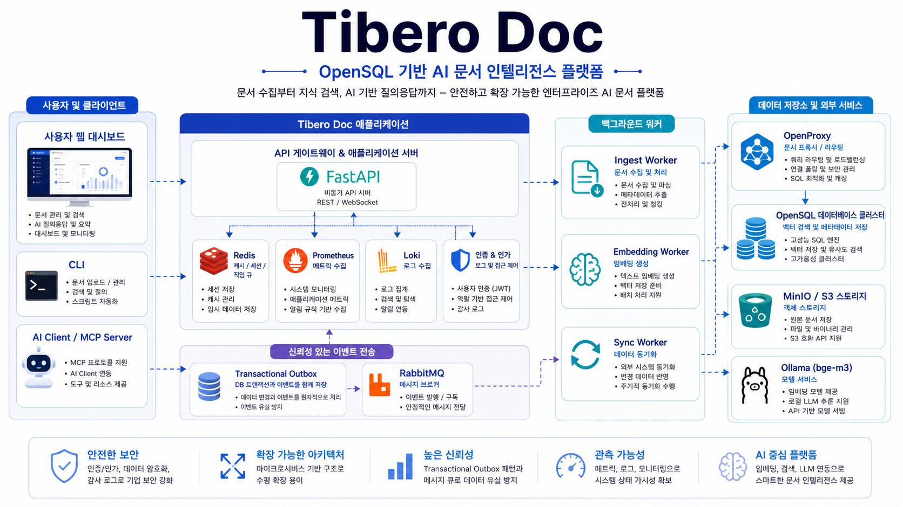
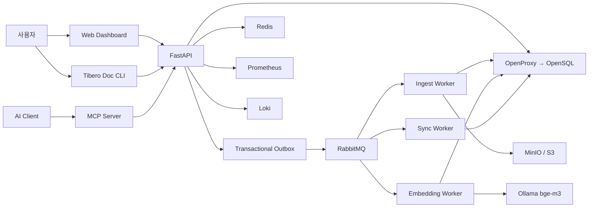

<div align="center">

# Tibero Doc

### 장애에도 멈추지 않는 OpenSQL 위에서, 기업 문서를 이해하고 답하는 AI 문서 플랫폼

[](https://www.python.org/)
[](https://fastapi.tiangolo.com/)
[](docs/development-guide.md)
[](docs/data-platform-operations.md)
[](docs/development-guide.md)

문서를 업로드하면 텍스트 추출, 청크 분할, 임베딩, 지식 그래프 색인을 자동으로 수행합니다.
사용자는 Web·CLI·REST API·MCP에서 문서를 검색하고, 근거와 함께 질문할 수 있습니다.

**[5분 빠른 시작](#-5분-빠른-시작)** · **[사용 방법](#-사용-방법)** · **[운영 대시보드](#-운영-대시보드)** · **[개발 문서](#-개발-문서)**



<sub>사용자·AI Client부터 OpenSQL·Worker·Object Storage·관측성까지 이어지는 Tibero Doc의 전체 처리 흐름</sub>

</div>

---

## 주요 기능

- **자동 문서 처리** — PDF, DOCX, TXT, HTML 업로드와 버전·메타데이터 관리
- **Graph + Vector 검색** — 키워드, `bge-m3` 임베딩, 엔티티 관계를 RRF로 결합
- **근거 기반 질의응답** — 관련 문서와 청크를 찾고 출처를 포함해 답변
- **다중 사용자 협업** — 조직, Workspace, 역할, 그룹, 문서 ACL, 감사 로그
- **안전한 비동기 처리** — Ingest·Embedding·Sync Worker, Retry, DLQ, Outbox
- **데이터 플랫폼 운영** — MinIO Hot/Warm/Cold, Airflow 재색인, 데이터 계보
- **통합 관측성** — Worker heartbeat, 큐 상태, RPS, p95, 로그, OpenSQL 노드 상태
- **표준 연결** — Web UI, Typer CLI, OpenAPI REST, MCP stdio/HTTP

## 🚀 5분 빠른 시작

### 1. 설치

Windows PowerShell:

```powershell
cd C:\path\to\opensource_comp_tibero_opensql
python -m venv .venv
.\.venv\Scripts\Activate.ps1
python -m pip install -e services\api -e cli
```

WSL/Linux:

```bash
sudo apt install -y python3-venv
python3 -m venv .venv
source .venv/bin/activate
python -m pip install -e services/api -e cli
```

### 2. 인프라 실행

OpenSQL/OpenProxy가 실행 중인 상태에서 공통 서비스를 시작합니다.

```powershell
docker compose up -d redis rabbitmq loki prometheus grafana
docker compose --profile ai up -d ollama
docker compose exec ollama ollama pull bge-m3
```

### 3. 최초 설정

```powershell
tibero-doc setup
tibero-doc migrate
```

설정 마법사에서 입력하는 비밀번호는 용도가 다릅니다.

| 항목 | 용도 |
|---|---|
| 관리자 로그인 비밀번호 | Web 대시보드와 사용자 로그인 |
| DB 비밀번호 | API·Worker가 OpenSQL/OpenProxy에 연결 |
| RabbitMQ 비밀번호 | Worker 메시지 브로커 연결 |

DB 비밀번호는 설정 파일에 평문으로 저장하지 않고 운영체제 자격 증명 저장소를 사용합니다.

### 4. API와 Worker 실행

API 터미널:

```powershell
tibero-doc serve
```

각각 별도 터미널에서 실행합니다.

```powershell
tibero-doc worker serve ingest
tibero-doc worker serve embedding
tibero-doc worker serve sync
tibero-doc worker serve outbox
```

> [!IMPORTANT]
> 네 명령을 한 터미널에 연속 입력하는 것이 아니라, Worker마다 별도 터미널을 사용해야 합니다.

### 5. 접속

| 화면 | 주소 |
|---|---|
| 통합 Web 대시보드 | <http://127.0.0.1:8000> |
| OpenAPI 문서 | <http://127.0.0.1:8000/docs> |
| RabbitMQ 관리 | <http://127.0.0.1:15672> |
| Prometheus | <http://127.0.0.1:9090> |
| Grafana | <http://127.0.0.1:3000> |

## 🔎 사용 방법

### 로그인과 계정

```powershell
tibero-doc login --email user@example.com
tibero-doc whoami
tibero-doc workspace list
```

초대받은 사용자:

```powershell
tibero-doc join INVITE_TOKEN --email user@example.com --name "홍길동" --server http://docs-server:8000
```

### 문서 업로드

```powershell
# 파일 하나
tibero-doc ingest .\documents\policy.pdf

# 폴더 전체
tibero-doc ingest .\documents

# 비동기 처리 상태
tibero-doc job <JOB_ID>
```

지원 형식: **PDF · DOCX · TXT · HTML**

### 검색과 질문

```powershell
tibero-doc search "OpenSQL 장애 복구 정책"
tibero-doc search "개인정보 보존 기간" --mode hybrid --top-k 10
tibero-doc search "OpenSQL을 사용하는 프로젝트" --mode graph --explain
tibero-doc ask "장애 발생 시 복구 절차를 근거와 함께 설명해줘"
```

| 모드 | 동작 |
|---|---|
| `keyword` | OpenSQL Full Text Search |
| `vector` | `bge-m3` 의미 유사도 검색 |
| `graph` | 엔티티 일치와 관계 탐색 |
| `hybrid` | 세 검색 결과를 RRF로 결합하는 기본값 |

낮은 관련도의 결과는 억지로 반환하지 않고 `관련성이 높은 문서를 찾지 못했습니다`라고 안내합니다.

### 문서 관리

```powershell
tibero-doc list
tibero-doc show <DOCUMENT_ID>
tibero-doc versions <DOCUMENT_ID>
tibero-doc download <DOCUMENT_ID> --output report.pdf
tibero-doc delete <DOCUMENT_ID>
tibero-doc sync
```

### 그래프와 재색인

```powershell
tibero-doc graph <DOCUMENT_ID>
tibero-doc graph-reindex
tibero-doc embedding-reindex
```

모델을 변경한 뒤에는 `embedding-reindex`를 반드시 실행합니다.

## 👥 협업과 권한

```powershell
# 그룹
tibero-doc group create Readers
tibero-doc group list
tibero-doc group add-member <GROUP_ID> <USER_ID>

# 문서 ACL
tibero-doc acl grant <DOCUMENT_ID> <GROUP_ID> --type group --permission read
tibero-doc acl list <DOCUMENT_ID>
tibero-doc acl revoke <DOCUMENT_ID> <GROUP_ID> --type group

# 사용자 관리
tibero-doc invite user@example.com --role editor
tibero-doc user list
tibero-doc user change-role <USER_ID> editor
tibero-doc user disable <USER_ID>
```

역할은 `viewer`, `editor`, `manager`, `owner` 순으로 권한이 커집니다. 검색·질문·조회·다운로드는 항상 Workspace와 문서 ACL을 먼저 검사합니다.

## 📊 운영 대시보드

Manager 이상 사용자는 Web에서 다음 상태를 통합 조회할 수 있습니다.

| 원천 | 표시 정보 |
|---|---|
| OpenSQL | 문서·청크·임베딩·사용자·Job·Outbox |
| RabbitMQ | Ready·Processing·Retry·DLQ·Consumer |
| Redis | Worker heartbeat·현재 Job·누적 처리량 |
| Prometheus | API RPS·p95·Worker 처리율 |
| Loki | API·Worker 구조화 로그 |
| Patroni | Primary·Replica·Lag·Timeline |

Worker는 기본 10초마다 heartbeat를 갱신하며 30초 동안 갱신되지 않으면 Offline으로 판단합니다. 상세 설정과 장애 대응은 [데이터 플랫폼 운영 가이드](docs/data-platform-operations.md)를 참고하세요.

## 🔌 MCP 연결

```powershell
# 로컬 stdio
tibero-doc mcp serve

# Streamable HTTP
tibero-doc mcp serve --transport streamable-http --port 8001
tibero-doc mcp status
```

로컬 MCP와 Ollama에는 API 키가 필요하지 않습니다. 외부 공개 시 Nginx/API Gateway에서 TLS와 접근 인증을 적용해야 합니다.

## 프로젝트가 해결하는 문제

| 기존 방식 | Tibero Doc |
|---|---|
| 파일명이나 정확한 단어를 알아야 검색 | 키워드·벡터·그래프를 결합한 의미 검색 |
| 문서 추가 후 수동 색인 | 업로드 즉시 추출·청킹·임베딩·관계 색인 |
| 검색 결과의 근거가 불명확 | 문서별 근거 문장, 점수, PDF 페이지 제공 |
| 사용자별 접근 범위 관리가 어려움 | Workspace·RBAC·사용자/그룹 ACL 적용 |
| DB 또는 Worker 장애 시 작업 유실 위험 | OpenSQL HA, RabbitMQ Retry/DLQ, Transactional Outbox |
| 운영 상태가 여러 시스템에 흩어짐 | OpenSQL·RabbitMQ·Redis·Prometheus·Loki 통합 대시보드 |

## 시스템 구성과 처리 흐름

대표 구조도는 상단 이미지를 참고하세요. 구현 관점의 데이터 흐름은 다음과 같습니다.



## 🧪 테스트

```powershell
# 전체 기본 테스트
python -m pytest -q

# 실제 RabbitMQ 통합 테스트
$env:RUN_RABBITMQ_TESTS="1"
python -m pytest tests\integration\rabbitmq -q

# 실제 OpenSQL 통합 테스트
$env:OPENPROXY_TEST_DSN=$env:TIBERO_DOC_DSN
python -m pytest tests\integration\database -q
```

외부 인프라 테스트는 필요한 환경변수가 없으면 자동으로 건너뜁니다.

## 🩺 문제 해결

```powershell
tibero-doc doctor
tibero-doc status
tibero-doc worker status
docker compose ps
```

| 증상 | 해결 방향 |
|---|---|
| `WinError 10048` | 기존 8000 포트 API 종료 후 재시작 |
| Dashboard `Not Found` | 오래된 API 프로세스를 종료하고 현재 가상환경에서 `tibero-doc serve` |
| Worker `0 ONLINE` | `REDIS_URL` 확인 후 Worker 재시작, 30초 대기 |
| `locked_at does not exist` | `tibero-doc migrate` 실행 |
| 작업이 계속 대기 | RabbitMQ와 Ingest/Embedding Worker 확인 |
| 의미 검색 결과 없음 | Ollama·`bge-m3`·`embedding-reindex` 확인 |
| OpenSQL 로그인 실패 | OpenProxy 주소와 DB 비밀번호 확인 |

## 📚 개발 문서

- [문서 안내](docs/README.md) — 목적별 문서 탐색
- [개발 및 아키텍처 가이드](docs/development-guide.md) — 모듈, 데이터 흐름, 설계 원칙
- [데이터 플랫폼 운영 가이드](docs/data-platform-operations.md) — 실행, 모니터링, Retry/DLQ, Outbox
- [전체 코드 리뷰 가이드](docs/code-review-guide.md) — 함수·클래스·예외 경계
- [비정형 데이터 수명주기](docs/unstructured-data-lifecycle.md) — Hot/Warm/Cold와 삭제 승인

## 라이선스

현재 `LICENSE` 파일은 비어 있습니다. 공개 배포 및 대회 제출 전에 팀이 선택한 라이선스(MIT 또는 Apache-2.0 등)의 전문을 반드시 추가해야 합니다.

---

<div align="center">

**Tibero Doc — 기업 문서를 안전하게 연결하고, 근거와 함께 답합니다.**

</div>
