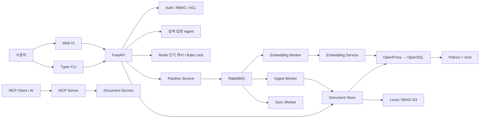
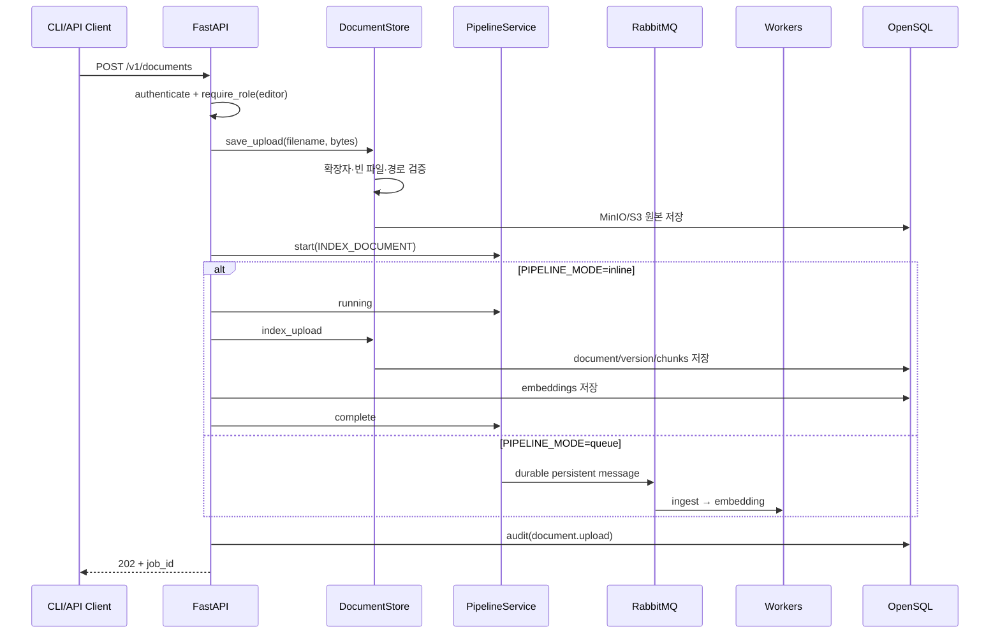

# Tibero Doc 코드 리뷰 가이드

이 문서는 현재 구현된 Tibero Doc 전체 코드를 혼자 읽고 검토하기 위한 안내서다. 기능 소개보다
`CLI → API → 인증 → 저장소/큐 → OpenSQL·Redis·MinIO`의 호출 흐름, 핵심 함수와 클래스,
트랜잭션 및 예외 경계를 중심으로 설명한다.

## 1. 시스템 한눈에 보기



핵심 설계 원칙은 다음과 같다.

- 일반 사용자는 OpenSQL에 직접 연결하지 않고 API 토큰으로 API만 호출한다.
- 모든 다중 사용자 데이터 조회는 `workspace_id`를 기준으로 격리한다.
- 문서 원본은 Object Storage, 메타데이터·청크·벡터·권한은 OpenSQL에 저장한다.
- API는 `inline` 또는 RabbitMQ 기반 `queue` 처리 방식을 선택한다.
- Redis는 성능 계층이며 권한과 영구 데이터의 진실 공급원은 OpenSQL이다.
- Agent는 ACL이 적용된 검색 결과만 답변 근거로 사용한다.

## 2. 권장 리뷰 순서

1. [`services/api/main.py`](../services/api/main.py): 외부 API와 전체 조립 지점
2. [`services/api/auth.py`](../services/api/auth.py): 사용자, 토큰, RBAC, ACL
3. [`services/api/store.py`](../services/api/store.py): 문서 수집, 청킹, 검색, 버전
4. [`infra/opensql/init.sql`](../infra/opensql/init.sql): 실제 데이터 모델
5. [`packages/core/pipeline`](../packages/core/pipeline): 작업 상태와 큐
6. [`workers`](../workers): 비동기 실행부
7. [`packages/core/embedding_service.py`](../packages/core/embedding_service.py): 임베딩
8. [`services/api/agent.py`](../services/api/agent.py), [`cache.py`](../services/api/cache.py): Agent와 Redis
9. [`services/mcp_server`](../services/mcp_server): MCP 도구
10. [`cli/src/tibero_doc`](../cli/src/tibero_doc): 사용자 명령과 설정
11. [`tests`](../tests): 계약 및 회귀 검증
12. [`infra`](../infra): 운영, TLS, 다중 인스턴스, HA

## 3. API 애플리케이션

### 3.1 조립 함수

[`services/api/main.py`](../services/api/main.py)의 주요 팩토리 함수:

| 함수 | 책임 |
|---|---|
| `get_store()` | 인증 문맥 없는 기본 `DocumentStore` 선택 |
| `_store_for(context)` | `workspace_id`, `user_id`가 주입된 OpenSQL 저장소 생성 |
| `get_job_repository()` | OpenSQL 또는 JSON 작업 저장소 선택 |
| `get_publisher()` | `RabbitMQPublisher` 생성 |
| `get_pipeline()` | `PIPELINE_MODE`에 따라 inline/queue 구성 |
| `get_embeddings()` | 환경 변수 기반 Provider와 Repository 조립 |
| `_embed_document()` | 문서 청크 조회 후 임베딩 생성·저장 |

FastAPI 시작 시 `RateLimitMiddleware`가 등록되고, `services/web`이 존재하면 `/ui`에 정적
웹 UI가 마운트된다.

### 3.2 요청 모델

Pydantic 모델이 API 경계에서 잘못된 입력을 422로 차단한다.

- `SearchRequest`: 검색어, `top_k`, `keyword|vector|hybrid`
- `AgentRequest`: 질문과 최대 근거 개수
- `InvitationRequest`, `JoinRequest`, `LoginRequest`, `RefreshRequest`
- `GroupRequest`, `GroupMemberRequest`, `ACLRequest`, `RoleRequest`

`Field(pattern=...)`, 길이, 최소·최대 숫자 제약은 라우트 코드보다 먼저 평가된다.

### 3.3 문서 업로드 흐름



`ingest_document()`의 중요한 예외 경계:

- `ValueError`(지원하지 않는 확장자, 빈 문서 등) → HTTP 400
- `PipelinePublishError` → HTTP 503, 작업은 `failed`로 기록
- inline 처리 중 기타 예외 → 작업을 `failed`로 전환하고 HTTP 422
- 성공 여부와 별개로 역할은 최소 `editor`여야 한다.

### 3.4 조회·다운로드·삭제

- `list_documents()`: 현재 워크스페이스 및 ACL 조건으로 목록 조회
- `get_document()`: **OpenSQL ACL 검사 → Redis 조회 → OpenSQL 조회** 순서
- `download_document()`: ACL 확인 후 로컬 bytes 또는 S3 presigned URL 반환
- `delete_document()`: `manager` 이상, 삭제 후 Redis 캐시 무효화
- `document_versions()`: 현재 문서의 파일명을 기준으로 버전 이력 조회

캐시보다 ACL을 먼저 검사하는 이유는 제한 문서를 관리자가 캐시한 뒤 Viewer가 같은 캐시 키를
사용해 읽는 권한 우회를 막기 위해서다.

### 3.5 검색과 Agent

`search_documents()`는 검색 모드에 따라 쿼리 임베딩을 만든 후 `store.search()`를 호출한다.
OpenSQL 저장소는 다음 두 결과를 RRF(Reciprocal Rank Fusion) 방식으로 결합한다.

- PostgreSQL FTS: `tsvector`, `websearch_to_tsquery`, `ts_rank_cd`
- pgvector: cosine distance `<=>`

`ask_agent()`는 동일한 ACL 적용 검색 결과를 `answer_question()`으로 전달하고, 답변과 별도로
`document_id`, 파일명, 청크 번호, 점수를 인용 목록에 넣는다.

[`services/api/agent.py`](../services/api/agent.py)의 Provider:

- `local`: 상위 3개 청크를 인용하는 추출형 답변, API 키 불필요
- `ollama`: `/api/generate` 호출
- `openai`: OpenAI-compatible `/chat/completions` 호출

검색 결과가 없으면 생성 모델을 호출하지 않고 “관련 문서를 찾지 못했다”고 답한다. 외부 모델의
HTTP 오류는 현재 상위 FastAPI 예외 처리기로 전파되므로 운영에서는 502 변환과 재시도 정책을
추가할 여지가 있다.

### 3.6 관리 API

| 영역 | 주요 함수 | 최소 역할 |
|---|---|---|
| 그룹 | `create_group`, `add_group_member`, `remove_group_member` | manager |
| ACL | `grant_document_acl`, `list_document_acl`, `revoke_document_acl` | manager |
| 워크스페이스 | `list_workspaces`, `switch_workspace` | member |
| 사용자 | `list_users` | manager |
| 역할/비활성화 | `change_user_role`, `disable_user` | owner |
| 감사 로그 | `audit_logs` | manager |
| 저장소 상태 | `storage_status` | manager |
| 보존 계획 | `retention_plan` | manager |

`retention_plan()`은 파괴 작업을 하지 않는 dry-run이다. `updated_at`과 `metadata.legal_hold`로
Hot/Warm/Cold/Delete candidate를 분류하며 `automatic_delete=False`를 명시한다.

## 4. 인증, RBAC, ACL

[`services/api/auth.py`](../services/api/auth.py)의 중심 타입은 `AuthContext`다.

```text
user_id + workspace_id + organization_id + email + display_name + role
```

### 4.1 계정과 토큰 함수

| 함수 | 동작 |
|---|---|
| `_hash()` | 원본 토큰을 SHA-256 해시로 변환; DB에는 원문을 저장하지 않음 |
| `bootstrap_owner()` | 사용자·조직·워크스페이스·Owner 멤버십 생성/재사용 |
| `issue_token()` | `tdoc_...` Access Token 발급, 선택적 만료 시간 |
| `login()` | Argon2 비밀번호 검증, 15분 Access + 30일 Refresh 발급 |
| `refresh_access_token()` | 기존 Refresh를 잠그고 폐기한 뒤 새 쌍 발급 |
| `authenticate()` | Bearer 해시 조회, 만료·폐기·사용자 상태·멤버십 확인 |
| `require_role()` | viewer < editor < manager < owner 순서 검사 |

Refresh Token 조회에는 `FOR UPDATE`가 사용된다. 같은 Refresh Token을 동시에 재사용할 때 한
트랜잭션만 성공시키기 위한 장치다.

### 4.2 초대와 ACL

- `create_invitation()`: manager 이상, 7일 만료, 선택적 이메일 제한
- `accept_invitation()`: 토큰·만료·이메일 검사 후 멤버십 upsert
- `can_access_document()`: workspace 일치 후 공개 범위, 소유자, 사용자/그룹 ACL, 관리자 역할 검사
- `audit()`: 조직·워크스페이스·행위자·리소스·상세 JSON 기록

주의: `can_access_document(..., permission=...)`의 `permission` 인자는 현재 SQL 권한 수준
비교에 사용되지 않는다. 지금은 read 접근 여부만 판정하므로 write/manage ACL을 세분화하려면
명시적인 permission hierarchy가 필요하다.

## 5. 문서 저장소와 검색

[`services/api/store.py`](../services/api/store.py)는 로컬 MVP와 OpenSQL 구현을 같은 인터페이스로
제공한다.

### 5.1 데이터 타입과 파서

- `Chunk`: 청크 인덱스와 내용
- `DocumentRecord`: 색인 완료 문서 정보
- `StoredDocument`: 업로드 직후 원본 위치와 object key
- `_HTMLTextExtractor`: HTML 텍스트 추출기
- `extract_text()`: TXT/HTML/PDF/DOCX 분기
- `split_text()`: 기본 1,000자, 150자 overlap 청킹

`_normalize_text()`는 공백을 정규화한다. 빈 추출 결과는 실패로 처리해 빈 임베딩과 검색 불능
문서가 정상 완료되는 것을 막는다.

### 5.2 `DocumentStore`

로컬 파일과 JSON 인덱스를 사용하는 구현이다.

- `save_upload()`: 파일명 정규화, 확장자·크기 검사, 원본 저장
- `index_upload()` / `_index_file_unlocked()`: 텍스트 추출, 청킹, checksum 기반 문서 생성
- `search()`: 로컬 키워드 점수 검색
- `sync()`: 디렉터리와 인덱스의 추가·변경·삭제 비교
- JSON 변경은 `FileLock`과 임시 파일 교체로 프로세스 간 손상을 줄인다.

### 5.3 `OpenSQLDocumentStore`

`DocumentStore`를 상속하되 영속화와 검색을 OpenSQL로 교체한다.

- 생성자에 `workspace_id`, `user_id`를 주입해 모든 SQL 범위를 제한한다.
- `save_upload()`은 원본을 Object Storage에 먼저 기록한다.
- 문서 ID는 `sha256(workspace_id:checksum)[:16]`으로 결정적 생성된다.
- 동일 파일명·동일 checksum은 재색인하지 않는다.
- 동일 파일명·변경된 checksum은 버전을 증가시킨다.
- 청크와 문서, 버전은 같은 DB 연결 컨텍스트에서 기록된다.
- 검색 SQL 안에 workspace와 사용자/그룹 ACL 조건이 포함된다.

리뷰 시 확인할 점:

- 원본 Object Storage 기록과 DB 색인은 단일 분산 트랜잭션이 아니다. DB 실패 시 orphan object가
  남을 수 있으므로 정리 작업이 필요하다.
- 이전 문서를 삭제한 뒤 새 버전을 insert하는 방식이므로 중간 실패 시 트랜잭션 rollback 여부를
  반드시 유지해야 한다. `connect()` 컨텍스트가 정상 종료 시 commit, 예외 시 rollback한다.
- `chunks_for_document()`는 호출자가 이미 권한을 검증했다는 전제로 document_id만 조건에 둔다.

## 6. Object Storage

[`packages/core/object_storage.py`](../packages/core/object_storage.py):

- `ObjectStorage`: `put/get/delete/download_url` 경계
- `LocalObjectStorage`: 로컬 경로 저장, resolve 후 루트 이탈 방지
- `S3ObjectStorage`: boto3, bucket 자동 생성, AES256 server-side encryption, presigned URL
- `object_storage_from_env()`: `OBJECT_STORAGE=s3|minio`이면 S3 구현 선택

S3 자격 증명은 환경 변수로만 받고 DB나 설정 파일에 저장하지 않는다.

## 7. 임베딩

[`packages/core/embedding_service.py`](../packages/core/embedding_service.py):

- `EmbeddingProvider`와 `EmbeddingRepository` Protocol로 생성과 저장을 분리한다.
- `LocalHashEmbeddingProvider`: 단어와 문자 trigram을 SHA-256 bucket에 투영하고 L2 정규화한다.
- `OpenAICompatibleEmbeddingProvider`: `/embeddings`, 응답 index 정렬, 벡터 개수 검증
- `JsonEmbeddingRepository`: 파일 잠금 + atomic replace
- `OpenSQLEmbeddingRepository`: 기존 문서 벡터 삭제 후 pgvector 일괄 insert
- `EmbeddingService.embed_document()`: 청크 순서를 보존해 벡터와 `chunk_index`를 결합

로컬 해시 임베딩은 오프라인 데모용이다. 의미 검색 품질을 평가할 때 실제 임베딩 모델 결과와
혼동하지 않아야 한다.

## 8. Pipeline과 RabbitMQ

### 8.1 상태 모델

[`packages/core/pipeline/models.py`](../packages/core/pipeline/models.py):

```text
QUEUED ──→ RUNNING ──→ COMPLETED
   └────────┴────────→ FAILED
```

- `JobType`: `INDEX_DOCUMENT`, `EMBED_DOCUMENT`, `SYNC_DOCUMENTS`
- `PipelineStage`: ingest, embedding, sync
- `PipelineJob`: 불변 dataclass, payload/result/error와 시간 포함

### 8.2 `PipelineService`

- `start()`: UUID job 생성·저장 후 publisher 호출
- publish 실패: job을 FAILED로 기록하고 `PipelinePublishError`
- `_transition()`: 허용 상태표 이외 전환은 `PipelineStateError`
- final 상태는 다시 running/completed로 바꿀 수 없다.

Repository는 `JsonJobRepository`와 `OpenSQLJobRepository` 두 구현이다. JSON 구현은 파일 잠금과
atomic replace, OpenSQL 구현은 행 insert/update와 `rowcount` 검사를 사용한다.

### 8.3 Worker

- `IngestJobProcessor`: 원본 색인 후 embedding job 발행
- `EmbeddingJobProcessor`: 청크 조회 후 벡터 생성
- `SyncJobProcessor`: 변경 문서를 동기화하고 각 문서의 embedding job 발행
- `consume_jobs()`: durable queue, persistent message, prefetch 설정, 수평 확장 가능

Processor는 예외를 잡아 job을 FAILED로 기록한다. `consume_jobs()`는 현재 처리 예외 여부와 관계없이
마지막에 ACK한다. 즉 애플리케이션 수준 재시도는 자동 redelivery가 아니라 별도 retry/dead-letter
정책으로 구현해야 한다. 운영 리뷰에서 가장 먼저 결정할 항목 중 하나다.

## 9. Redis

### 9.1 인기 문서 캐시

[`services/api/cache.py`](../services/api/cache.py)의 `PopularDocumentCache`:

- Sorted Set `tibero-doc:popular:{workspace}`에서 조회 횟수 증가
- 기본 3회 이상 조회하면 `SETEX`로 문서+청크 JSON 저장
- 기본 TTL 300초
- Redis 연결·직렬화 실패는 cache miss로 처리해 본 서비스 지속
- ACL 변경과 문서 삭제 시 `invalidate()`

현재 인기 점수는 무기한 누적된다. 장기간 운영 시 일별 감쇠 또는 기간 bucket을 넣어 과거 인기
문서가 영구적으로 hot 상태가 되지 않도록 개선할 수 있다.

### 9.2 Rate Limit

`RateLimitMiddleware`는 Authorization header 또는 IP를 SHA-256 키로 바꾼다.

- Redis가 정상이면 분 단위 counter + 70초 TTL
- Redis가 없으면 프로세스 메모리 sliding window
- 초과 시 429와 `Retry-After: 60`
- 정상 응답에 `X-RateLimit-*` 헤더
- `/health`, `/static`은 제외

메모리 fallback은 다중 API 인스턴스 간 공유되지 않으므로 운영에서는 Redis가 사실상 필수다.

## 10. MCP

[`services/mcp_server/main.py`](../services/mcp_server/main.py)는 다음 도구를 노출한다.

- `search_documents`
- `list_documents`
- `get_document`
- `get_job_status`
- `get_document_stats`

`MCPDocumentService`가 API 저장소·파이프라인·임베딩을 조립한다. 인증 모드가 required이고 DB를
사용하면 `TIBERO_DOC_ACCESS_TOKEN`이 필수다. 전송은 stdio 또는 streamable HTTP다.

## 11. CLI

### 11.1 진입점과 HTTP Client

[`cli/src/tibero_doc/main.py`](../cli/src/tibero_doc/main.py)는 모든 Typer command/sub-app을 등록한다.
실제 HTTP는 [`TiberoDocClient`](../cli/src/tibero_doc/client.py)가 담당한다.

`TiberoDocClient`는:

- `config.toml`의 API URL 사용
- OS credential store의 Access Token을 Bearer header로 주입
- 새 CLI가 구 API에 접속해 404가 나면 서버 재시작 안내
- 문서·인증·그룹·ACL·사용자·Agent·보존 API를 얇게 래핑

### 11.2 명령 모듈

| 파일 | 명령 |
|---|---|
| `commands/onboarding.py` | setup, serve, doctor |
| `commands/collaboration.py` | login, refresh, whoami, invite, join, audit |
| `commands/manage.py` | list, show, delete, versions, job |
| `commands/administration.py` | group, ACL, workspace, user, MCP, worker, storage, deploy, failover, retention |
| `commands/agent.py` | ask |
| `commands/ingest.py`, `search.py`, `sync.py` | 핵심 문서 동작 |
| `commands/settings.py` | config show/path/reset |

### 11.3 설정과 비밀정보

[`cli/src/tibero_doc/config.py`](../cli/src/tibero_doc/config.py):

- 공개 설정은 `~/.tibero-doc/config.toml`
- DB 비밀번호와 Access/Refresh Token은 keyring
- `build_dsn()`은 사용자와 비밀번호를 URL encode
- `runtime_environment()`가 서버 실행용 환경 변수를 구성

`setup_command()`은 TCP 연결과 실제 DB 인증이 성공해야 설정을 저장한다. DB 비밀번호와 서비스
관리자 비밀번호를 별도 프롬프트로 받는다. `serve_command()`도 시작 전에 DB 연결을 검사한다.

## 12. OpenSQL 스키마

[`infra/opensql/init.sql`](../infra/opensql/init.sql)의 테이블 그룹:

| 그룹 | 테이블 |
|---|---|
| 조직/인증 | users, organizations, workspaces, workspace_members |
| 토큰/초대 | api_tokens, refresh_tokens, invitations |
| 권한/감사 | groups, group_members, document_acl, audit_logs |
| 문서 | documents, document_versions, chunks |
| 검색 | chunk_embeddings(vector) |
| 작업 | pipeline_jobs, outbox_events |

주요 인덱스:

- workspace+filename unique
- workspace+updated_at
- chunks GIN FTS
- 384차원 local hash embedding HNSW cosine
- 미발행 outbox partial index

문서 INSERT/UPDATE/DELETE trigger가 `outbox_events`에 변경 이벤트를 기록한다. 현재 코드에는 이
Outbox를 외부로 발행하고 `published_at`을 갱신하는 전용 dispatcher가 완성되어 있지 않아
`pending_events`가 계속 증가할 수 있다.

## 13. 예외 처리 표

| 위치/예외 | 현재 처리 |
|---|---|
| Pydantic 입력 오류 | HTTP 422 |
| 미인증/만료/폐기 토큰 | HTTP 401 |
| 역할 부족 | HTTP 403 |
| 문서 ACL 거부 | HTTP 403 |
| 리소스 없음 | HTTP 404 |
| 잘못된 파일·초대 | HTTP 400 |
| RabbitMQ publish 실패 | job FAILED + HTTP 503 |
| inline 색인 실패 | job FAILED + HTTP 422 |
| Redis 장애 | 캐시/분산 limit 포기 후 OpenSQL 또는 메모리 fallback |
| 외부 Embedding/LLM HTTP 오류 | 현재 상위로 전파; 502 변환·retry 개선 가능 |
| JSON 저장소 손상 | `RuntimeError` |
| 잘못된 Pipeline 상태 전환 | `PipelineStateError` |
| DB 설정 없음 | `RuntimeError(TIBERO_DOC_DSN...)` |
| 구 API와 새 CLI 불일치 | CLI가 API 재시작 안내 |

## 14. 환경 변수

| 범주 | 주요 변수 |
|---|---|
| DB | `TIBERO_DOC_DSN`, `DATABASE_URL`, `AUTH_MODE` |
| Pipeline | `PIPELINE_MODE`, `RABBITMQ_URL`, `WORKER_PREFETCH` |
| 임베딩 | `EMBEDDING_PROVIDER`, `EMBEDDING_MODEL`, `EMBEDDING_DIMENSIONS`, `EMBEDDING_API_URL`, `EMBEDDING_API_KEY` |
| Agent | `AGENT_PROVIDER`, `AGENT_MODEL`, `OPENAI_API_KEY`, `OPENAI_BASE_URL`, `OLLAMA_BASE_URL` |
| Redis | `REDIS_URL`, `RATE_LIMIT_PER_MINUTE`, `DOCUMENT_CACHE_THRESHOLD`, `DOCUMENT_CACHE_TTL_SECONDS` |
| Object | `OBJECT_STORAGE`, `S3_ENDPOINT_URL`, `S3_ACCESS_KEY_ID`, `S3_SECRET_ACCESS_KEY`, `S3_BUCKET`, `S3_REGION` |
| SMTP | `SMTP_HOST`, `SMTP_PORT`, `SMTP_TLS`, `SMTP_USERNAME`, `SMTP_PASSWORD`, `SMTP_FROM` |
| MCP | `MCP_TRANSPORT`, `MCP_HOST`, `MCP_PORT`, `TIBERO_DOC_ACCESS_TOKEN` |

## 15. 테스트 구조

- `tests/unit`: 외부 서비스 없는 빠른 계약
- `tests/integration/database`: 실제 OpenProxy/OpenSQL, pgvector, 다중 사용자
- `tests/integration/rabbitmq`: durable/persistent/redelivery 계약
- `tests/integration/mcp`: stdio/streamable HTTP
- `tests/integration/storage`: 실제 MinIO 선택 테스트
- `tests/integration/deployment`: 다중 API와 TLS
- `tests/e2e`: 업로드 → ingest → embedding → 검색

일반 검증:

```powershell
powershell -ExecutionPolicy Bypass -File .\scripts\test-service.ps1 service
```

Failover 테스트는 실제 Primary를 중지하므로 명시적 확인 없이 실행하지 않는다.

## 16. 리뷰 체크리스트와 현재 개선 후보

### 보안

- [ ] 모든 새 쿼리에 `workspace_id` 조건이 있는가?
- [ ] 캐시 조회 전 ACL을 검사하는가?
- [ ] Owner 자신 또는 마지막 Owner의 역할 강등을 막아야 하는가?
- [ ] ACL의 read/write/manage 수준이 실제 동작에 반영되는가?
- [ ] 토큰·DB·SMTP·S3 비밀이 로그와 설정 파일에 남지 않는가?

### 데이터 정합성

- [ ] Object Storage 성공 후 DB 실패 orphan을 정리하는가?
- [ ] 문서 버전 교체가 한 DB 트랜잭션 안에서 수행되는가?
- [ ] Outbox dispatcher와 재시도/poison event 처리가 필요한가?
- [ ] 문서 ID 16자리 해시의 충돌 정책이 필요한가?

### 비동기 처리

- [ ] FAILED job 재시도 횟수와 dead-letter queue를 정의할 것인가?
- [ ] Worker가 항상 ACK하는 현재 정책이 운영 요구에 맞는가?
- [ ] 동일 job 중복 전달 시 processor가 충분히 idempotent한가?

### 검색·Agent

- [ ] 한국어 FTS와 실제 임베딩 모델의 품질 평가가 있는가?
- [ ] 외부 LLM timeout/429/5xx를 502와 retry로 처리할 것인가?
- [ ] 답변 인용 번호와 실제 citations 배열이 항상 일치하는가?
- [ ] prompt injection 문서에 대한 방어 정책이 필요한가?

### 운영

- [ ] Redis 인기 점수를 주기적으로 감쇠하는가?
- [ ] 다중 API에서 메모리 fallback Rate Limit을 허용할 것인가?
- [ ] MinIO backup/versioning/object lock이 설정됐는가?
- [ ] OpenSQL Failover 중 queue 처리와 API retry를 검증했는가?
- [ ] retention 삭제는 Legal Hold와 이중 승인을 거치는가?

## 17. 핵심 흐름을 디버깅하는 방법

1. `tibero-doc doctor`: API 이전에 OpenProxy와 DB 인증 확인
2. `tibero-doc status`: API/OpenSQL 및 현재 workspace 통계
3. `tibero-doc job <JOB_ID>`: queued/running/failed와 error 확인
4. `tibero-doc worker status`: queue 적체와 consumer 수 확인
5. `tibero-doc storage status`: Object Storage, Redis, 문서 통계 확인
6. `tibero-doc audit`: 누가 어떤 리소스를 조작했는지 확인
7. OpenSQL `pipeline_jobs`, `outbox_events`, `audit_logs` 순서로 조회

코드를 수정한 뒤 실행 중인 Uvicorn이 구 코드를 유지할 수 있다. 개발 중에는
`tibero-doc serve --reload`, 일반 실행에서는 `Ctrl+C` 후 `tibero-doc serve`로 재시작한다.

## 18. 문서 Knowledge Graph

[`packages/core/knowledge_graph.py`](../packages/core/knowledge_graph.py)가 청크에서 엔티티와 관계를
추출하고 OpenSQL `entities`, `document_entities`, `relationships`에 저장한다.

- `RuleBasedEntityExtractor`: 외부 API 없이 인물·조직·시스템·정책·프로젝트·주제 추출
- `EntityMention`: 엔티티 종류, 이름, 청크, confidence, metadata
- `EntityRelationship`: source/target, 관계 종류, 청크, confidence
- `KnowledgeGraphService.index_document()`: 재색인 후 upsert 및 provenance 저장
- `KnowledgeGraphService.document_graph()`: 문서 단위 엔티티·관계 반환
- `query_terms()`: 질문에서 그래프 검색 용어 정규화

`OpenSQLDocumentStore.search()`는 키워드, pgvector, 그래프 직접 매치와 1-hop 이웃을 각각
순위화한 후 RRF로 결합한다. 그래프 SQL에도 workspace와 사용자/그룹 ACL 조건이 포함된다.
