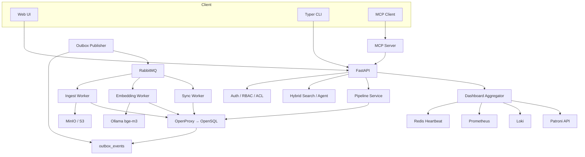
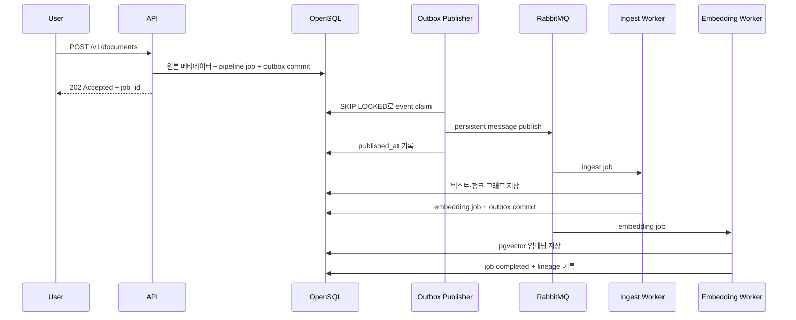

# Tibero Doc 개발 및 아키텍처 가이드

이 문서는 코드를 수정하거나 새로운 저장소·모델·Worker를 추가하려는 개발자를 위한 문서입니다. 사용자 명령은 루트 [README](../README.md), 배포와 장애 대응은 [운영 가이드](data-platform-operations.md)를 참고하세요.

## 1. 설계 목표

Tibero Doc은 다음 원칙을 기준으로 구성됩니다.

1. OpenSQL을 문서 메타데이터, 권한, 작업 상태와 검색 데이터의 진실 공급원으로 사용합니다.
2. 원본 바이너리는 MinIO/S3에 저장하고 OpenSQL에는 위치와 계보를 기록합니다.
3. API 요청과 무거운 문서 처리를 RabbitMQ로 분리합니다.
4. DB commit과 메시지 발행 사이의 유실은 Transactional Outbox로 방지합니다.
5. Redis 캐시나 대시보드 상태는 사라져도 OpenSQL에서 복구할 수 있어야 합니다.
6. 검색과 MCP를 포함한 모든 경로에서 Workspace와 ACL을 동일하게 검사합니다.
7. 외부 시스템 장애는 전체 Dashboard API 실패가 아니라 해당 구성요소 상태로 격리합니다.

## 2. 전체 구조



## 3. 소스 디렉터리

| 경로 | 책임 |
|---|---|
| `services/api` | FastAPI, 인증, 검색, Dashboard API, Redis 캐시 |
| `services/web` | 로그인, 검색, 운영 대시보드 정적 Web UI |
| `services/mcp_server` | MCP stdio/Streamable HTTP 도구 |
| `packages/core` | DB, 임베딩, 그래프, 저장소, 관측성 공통 모듈 |
| `packages/core/pipeline` | 작업 상태, Queue routing, Publisher, Outbox |
| `workers` | Ingest, Embedding, Sync, Outbox 장기 프로세스 |
| `cli/src/tibero_doc` | 설정 마법사와 사용자·관리자 CLI |
| `infra` | OpenSQL, HA, Nginx, Prometheus, Grafana, Airflow |
| `evaluation` | 검색 Gold Set과 Recall/MRR/nDCG 계산 |
| `loadtests` | Locust 부하 시나리오 |
| `tests` | unit, integration, e2e 테스트 |

## 4. 문서 처리 흐름

Queue 모드의 정상 흐름입니다.



`PIPELINE_MODE=inline`은 로컬 디버깅용으로 API 프로세스 안에서 처리합니다. 운영 기본값은 `queue`입니다.

## 5. Pipeline과 메시지 안전성

### 작업 상태

```text
queued → running → completed
                 └→ failed → queued (RabbitMQ 재전달 시)
```

`PipelineService`가 허용된 전이만 수행하며 완료된 작업은 다시 실행하지 않습니다. Worker가 실패하면 메시지는 `*.retry`로 이동하고 TTL 이후 정상 큐로 복귀합니다. 기본 재시도 한도를 초과하면 `*.dlq`에 보관합니다.

### Transactional Outbox

`OpenSQLJobRepository.create()`는 `pipeline_jobs`와 `outbox_events`를 동일한 DB transaction에 삽입합니다. `OpenSQLOutboxRepository.claim_batch()`는 `FOR UPDATE SKIP LOCKED`를 사용해 여러 Publisher가 동일 이벤트를 동시에 claim하지 않도록 합니다.

과거 스키마와 현재 코드의 불일치를 막기 위해 변경 전 다음 명령을 실행합니다.

```powershell
tibero-doc migrate
```

## 6. OpenSQL 데이터 모델

| 영역 | 핵심 테이블 |
|---|---|
| 협업 | `organizations`, `workspaces`, `users`, `workspace_members`, `groups`, `group_members` |
| 인증 | `api_tokens`, `refresh_tokens`, `invitations` |
| 문서 | `documents`, `document_versions`, `chunks`, `document_acl` |
| 검색 | `chunk_embeddings`, `entities`, `document_entities`, `relationships` |
| 파이프라인 | `pipeline_jobs`, `outbox_events` |
| 운영 | `audit_logs`, `data_lineage_events`, `object_lifecycle`, `schema_migrations` |

전체 초기 DDL은 `infra/opensql/init.sql`, 증분 변경은 `infra/opensql/migrations`에 둡니다. 적용된 migration은 SHA-256 checksum과 함께 기록되므로 이미 적용된 파일을 수정하지 말고 새 번호의 파일을 추가해야 합니다.

## 7. 하이브리드 검색

검색은 세 후보 집합을 독립적으로 생성합니다.

1. OpenSQL Full Text Search 기반 Keyword 후보
2. pgvector cosine distance 기반 Vector 후보
3. 엔티티 일치와 1-hop 관계 기반 Graph 후보

`hybrid` 모드는 RRF(Reciprocal Rank Fusion)로 순위를 결합합니다. 결과는 문서 ID 단위로 그룹화하고 문서당 관련 청크를 기본 3개까지 제공합니다.

주요 안전장치:

- `VECTOR_MIN_SIMILARITY` 기본값 0.50
- `SEARCH_MIN_RELEVANCE` 기본값 0.35
- `local-hash-*` 임베딩은 의미 검색 순위에서 제외
- 질의 중심 snippet과 일치 단어 생성
- PDF `page_number` 반환
- 검색 전 Workspace와 ACL 필터 적용

구현 위치는 `services/api/store.py`, 그래프 추출은 `packages/core/knowledge_graph.py`입니다.

## 8. 인증과 권한

- Argon2 비밀번호 해시
- 15분 Access Token
- 30일 회전형 Refresh Token
- Viewer / Editor / Manager / Owner RBAC
- 사용자·그룹 단위 문서 ACL
- 일회용 초대 토큰
- 사용자 활동 감사 로그

Web UI는 Access Token이 만료되면 Refresh Token을 이용해 자동 갱신합니다. 캐시는 권한 계층이 아니므로 문서 캐시 조회 전에도 OpenSQL ACL을 검사합니다.

## 9. 관측성과 Dashboard

| 데이터 종류 | 저장소 | 코드 |
|---|---|---|
| API·Worker 메트릭 | Prometheus | `services/api/metrics.py`, `packages/core/observability.py` |
| Worker 현재 상태 | Redis TTL heartbeat | `WorkerHeartbeat` |
| 구조화 로그 | Loki | `LokiHandler` |
| 큐 상태 | RabbitMQ Management API | `services/api/dashboard.py` |
| HA 노드 | Patroni REST API | `services/api/dashboard.py` |
| 영구 업무 상태 | OpenSQL | `pipeline_jobs`, `outbox_events`, 문서 테이블 |

`LokiHandler`는 비동기 Queue를 사용하며 `httpx/httpcore` 내부 전송 로그를 제외해 로그 전송이 자기 자신을 다시 기록하는 재귀를 방지합니다.

## 10. 개발 환경

```powershell
python -m pip install -e services\api -e cli
tibero-doc setup
tibero-doc migrate
docker compose up -d redis rabbitmq loki prometheus grafana
docker compose --profile ai up -d ollama
tibero-doc serve
```

Worker는 별도 터미널에서 실행합니다.

```powershell
tibero-doc worker serve ingest
tibero-doc worker serve embedding
tibero-doc worker serve sync
tibero-doc worker serve outbox
```

## 11. 테스트 전략

| 계층 | 검증 대상 |
|---|---|
| Unit | 상태 전이, 추출, 임베딩, 캐시, ACL, Dashboard aggregation |
| Integration | OpenSQL, pgvector, RabbitMQ, MinIO, MCP transport |
| E2E | 업로드 → Queue → Worker → 임베딩 → 검색 |
| Destructive | OpenSQL Primary 중지와 Pipeline 재처리 |
| Performance | Locust 동시 검색과 p95/RPS |
| Quality | Gold Set 기반 Recall@K, MRR, nDCG@K |

```powershell
python -m pytest -q
```

외부 테스트는 `RUN_RABBITMQ_TESTS`, `RUN_MINIO_TESTS`, `OPENPROXY_TEST_DSN`, `RUN_FAILOVER_TESTS`로 명시적으로 활성화합니다.

## 12. 확장 지점

- `EmbeddingProvider`: 다른 OpenAI-compatible 임베딩 모델
- `EntityExtractor`: LLM 기반 구조화 엔티티·관계 추출
- `EmbeddingRepository`: 다른 Vector Store
- `ObjectStorage`: 사내 Object Storage
- `JobPublisher`: 다른 Broker 또는 Event Bus
- Dashboard component collector: Kubernetes·Kafka·사내 모니터링 추가

새 구현은 Protocol 경계를 유지하고 unit test와 실제 인프라 integration test를 함께 추가해야 합니다.
